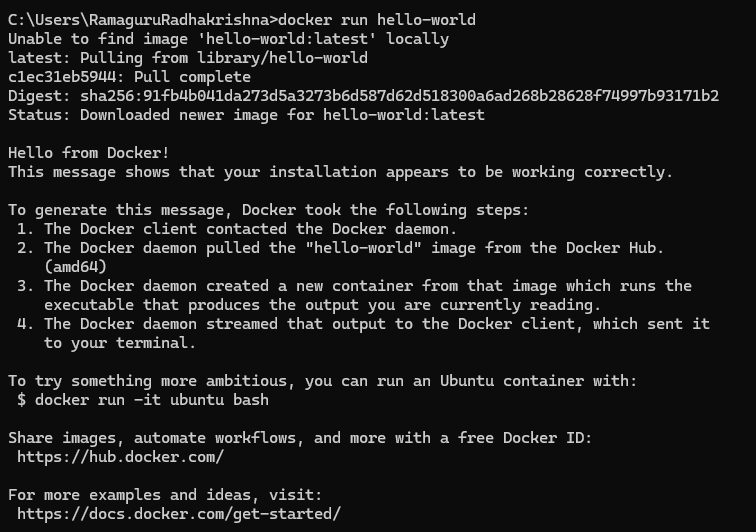
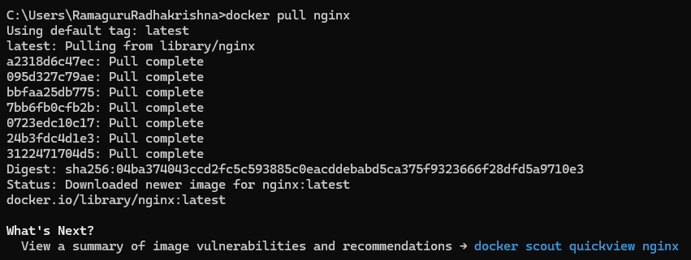

# 20CYS402 - Distributed Systems and Cloud Computing
   <br/>
   <br/>

## Docker


## Objective
To understand:
  - Docker and Docker Hub
  - Create Docker image and build
  - Upload the built docker image to Docker Hub

### Examples
- [Simple Dockerfile Building](https://www.youtube.com/watch?v=0HCBQpfQE7o)
- [Demo Dockerfile Building](https://www.youtube.com/watch?v=lrTBwlW46Ik)
- [Demo Image Running](https://www.youtube.com/watch?v=ND-qkZVc3KM)
- [Pushing Image to DockerHub](https://www.youtube.com/watch?v=pBdN1OlWGQc)

### Class Practice - 1

```
docker run hello-world
```

<p align="center">
  
</p>

### Class Practice - 2

```
docker pull nginx
```

<p align="center">
  
</p>

```
docker run -d -p 8080:80 nginx
```

### Class Practice - 3

- The base layer is "alpine"
- Set a Environmental Variable called "ROLLNO" to your full roll number (CB.EN.U4CYS210YY)
- Make a directory called "20CYS402"
- Change Directory to "20CYS402"
- Create a file called "Assignment.txt" and write your DockerHub username to it

### Assignment: Create a Docker Image for a Database Connector

####  Objective:
Build a Docker image for a database connector application. The application connects to a database using a specific programming language and requires the installation of certain packages. Set environment variables for database connection details and expose the application on a specific IP address and port.

#### Requirements:
 - Choose a base image appropriate for the chosen programming language (e.g., Python, Node.js, Ruby).
 - Install the necessary packages for connecting to a database. Choose a simple database connector library compatible with your chosen language (e.g., psycopg2 for Python, mysql2 for Node.js, pg for Ruby).
 - Set environment variables for the following database connection details:
   - Database host
   - Database port
   - Database username
   - Database password
   - Database name
 - Expose the application on a specific IP address and port (e.g., IP: 0.0.0.0, Port: 8080).
 - Create a sample application code that uses the installed database connector library to connect to a database (you can use dummy values for the connection).

#### Tips:
 - Use an official base image related to the chosen programming language.
 - Clearly document each step in the Dockerfile using comments.
 - Make sure to expose the correct port for your application.
 - Test the Docker image locally to ensure the database connector application is running.

#### Submission:
Provide the following in your submission:
 - The Dockerfile used to build the Docker image.
 - The source code of the sample application demonstrating the database connection.
 - Link to Image in Docker Hub.

#### DockerHub User ID and Assignment Submission Status

| Roll Number | Dockerhub Username |
|:-----------:|:------------------:|
| CB.EN.U4CYS21001 | [](https://hub.docker.com/u/abi080) |
| CB.EN.U4CYS21002 | [](https://hub.docker.com/u/achyuth03) |
| CB.EN.U4CYS21003 | [](https://hub.docker.com/u/aishwaryaggg) |
| CB.EN.U4CYS21004 | [](https://hub.docker.com/u/aishwaryags) |
| CB.EN.U4CYS21005 | [](https://hub.docker.com/u/alagusoundarya) |
| CB.EN.U4CYS21006 | [](https://hub.docker.com/u/vitalianferdo28) |
| CB.EN.U4CYS21007 | [](https://hub.docker.com/u/anupriya1901) |
| CB.EN.U4CYS21008 | [](https://hub.docker.com/u/anuvarshini09) |
| CB.EN.U4CYS21009 | [](https://hub.docker.com/u/aravindcollege) |
| CB.EN.U4CYS21010 | [](https://hub.docker.com/u/ashborn013h) |
| CB.EN.U4CYS21011 | [](https://hub.docker.com/u/metadevwastaken) |
| CB.EN.U4CYS21013 | [](https://hub.docker.com/u/rohithreddybasireddy) |
| CB.EN.U4CYS21015 | [](https://hub.docker.com/u/dyanesh003) |
| CB.EN.U4CYS21016 | [](https://hub.docker.com/u/hemsagar1143) |
| CB.EN.U4CYS21017 | [](https://hub.docker.com/u/nitingurusamy) |
| CB.EN.U4CYS21018 | [](https://hub.docker.com/u/gokul2003g) |
| CB.EN.U4CYS21019 | [](https://hub.docker.com/u/gokul030) |
| CB.EN.U4CYS21020 | [](https://hub.docker.com/u/hemesh66541) |
| CB.EN.U4CYS21021 | [](https://hub.docker.com/u/zoro9j) |
| CB.EN.U4CYS21022 | [](https://hub.docker.com/u/harshitha910) |
| CB.EN.U4CYS21025 | [](https://hub.docker.com/u/santhossh05) |
| CB.EN.U4CYS21026 | [](https://hub.docker.com/u/manoj601) |
| CB.EN.U4CYS21027 | [](https://hub.docker.com/u/tintinboy10) |
| CB.EN.U4CYS21028 | [](https://hub.docker.com/u/cbenu4cys21028) |
| CB.EN.U4CYS21030 | [](https://hub.docker.com/u/saisuvarchalak) |
| CB.EN.U4CYS21031 | [](https://hub.docker.com/u/kishanthk16) |
| CB.EN.U4CYS21032 | [](https://hub.docker.com/u/kishorem1300) |
| CB.EN.U4CYS21033 | [](https://hub.docker.com/u/suhithabala) |
| CB.EN.U4CYS21034 | [](https://hub.docker.com/u/lakshminarayan15) |
| CB.EN.U4CYS21035 | [](https://hub.docker.com/u/foxx22) |
| CB.EN.U4CYS21036 | [](https://hub.docker.com/u/ashwath4482) |
| CB.EN.U4CYS21037 | [](https://hub.docker.com/u/ganesh1809) |
| CB.EN.U4CYS21038 | [](https://hub.docker.com/u/madhavh10) |
| CB.EN.U4CYS21039 | [](https://hub.docker.com/u/manbendra) |
| CB.EN.U4CYS21042 | [](https://hub.docker.com/u/mittul31) |
| CB.EN.U4CYS21043 | [](https://hub.docker.com/u/maax213) |
| CB.EN.U4CYS21044 | [](https://hub.docker.com/u/ravichandraoo3) |
| CB.EN.U4CYS21045 | [](https://hub.docker.com/u/monish463) |
| CB.EN.U4CYS21046 | [](https://hub.docker.com/u/mukesh31sa) |
| CB.EN.U4CYS21047 | [](https://hub.docker.com/u/vihalroy47) |
| CB.EN.U4CYS21048 | [](https://hub.docker.com/u/niran2468) |
| CB.EN.U4CYS21049 | [](https://hub.docker.com/u/nishbhai) |
| CB.EN.U4CYS21050 | [](https://hub.docker.com/u/thisisnishanth) |
| CB.EN.U4CYS21051 | [](https://hub.docker.com/u/amiablejuggernaut) |
| CB.EN.U4CYS21052 | [](https://hub.docker.com/u/cys21052) |
| CB.EN.U4CYS21053 | [](https://hub.docker.com/u/nivedd) |
| CB.EN.U4CYS21054 | [](https://hub.docker.com/u/jivan01) |
| CB.EN.U4CYS21055 | [](https://hub.docker.com/u/ganasekhar) |
| CB.EN.U4CYS21056 | [](https://hub.docker.com/u/aji10112003) |
| CB.EN.U4CYS21057 | [](https://hub.docker.com/u/pushpanth) |
| CB.EN.U4CYS21058 | [](https://hub.docker.com/u/siddharthkrishna04) |
| CB.EN.U4CYS21059 | [](https://hub.docker.com/u/rakshan5555) |
| CB.EN.U4CYS21060 | [](https://hub.docker.com/u/ramsurya01) |
| CB.EN.U4CYS21061 | [](https://hub.docker.com/u/roshnivenkatesan04634) |
| CB.EN.U4CYS21062 | [](https://hub.docker.com/u/ruthwik2610) |
| CB.EN.U4CYS21063 | [](https://hub.docker.com/u/slayer21232) |
| CB.EN.U4CYS21066 | [](https://hub.docker.com/u/sanjaiprashad) |
| CB.EN.U4CYS21067 | [](https://hub.docker.com/u/cbenu4cys21067) |
| CB.EN.U4CYS21069 | [](https://hub.docker.com/u/seranpandiyan) |
| CB.EN.U4CYS21070 | [](https://hub.docker.com/u/Sharmashreeom8) |
| CB.EN.U4CYS21072 | [](https://hub.docker.com/u/tanvi7482) |
| CB.EN.U4CYS21073 | [](https://hub.docker.com/u/sudeep8186) |
| CB.EN.U4CYS21074 | [](https://hub.docker.com/u/sudhir253) |
| CB.EN.U4CYS21075 | [](https://hub.docker.com/u/Sudipt02) |
| CB.EN.U4CYS21076 | [](https://hub.docker.com/u/knightfallxz) |
| CB.EN.U4CYS21077 | [](https://hub.docker.com/u/Sushmanthvm) |
| CB.EN.U4CYS21079 | [](https://hub.docker.com/u/swetha7946) |
| CB.EN.U4CYS21080 | [](https://hub.docker.com/u/tpavan9999) |
| CB.EN.U4CYS21081 | [](https://hub.docker.com/u/dineshreddy81) |
| CB.EN.U4CYS21082 | [](https://hub.docker.com/u/kavya147) |
| CB.EN.U4CYS21083 | [](https://hub.docker.com/u/revan31) |
| CB.EN.U4CYS21084 | [](https://hub.docker.com/u/vinayak004) |
| CB.EN.U4CYS21085 | [](https://hub.docker.com/u/viinoth) |
| CB.EN.U4CYS21086 | [](https://hub.docker.com/u/viiinoth) |
| CB.EN.U4CYS21087 | [](https://hub.docker.com/u/gitsik) |
| CB.EN.U4CYS21089 | [](https://hub.docker.com/u/cryptoshinigami) |
| CB.EN.U4CYS21090 | [](https://hub.docker.com/u/Yuvarajkumargp) |

